<div style="display: flex; flex-direction: column; justify-content: center; align-items: center; height: 100vh;">

  <h2>Labs 1-5</h2>
  
  <p>Student ID: 23011392</p>
  <p>Student Name: Xiaojun Huang</p>

</div>

# Lab 1

## AWS Account and Log in

### [1] Log into an IAM user account created for you on AWS.

Starting by opening the URL provided in lab sheet 1, input the account and password as mentioned in the email. After logining
into the home page, change the password of my account immediately.
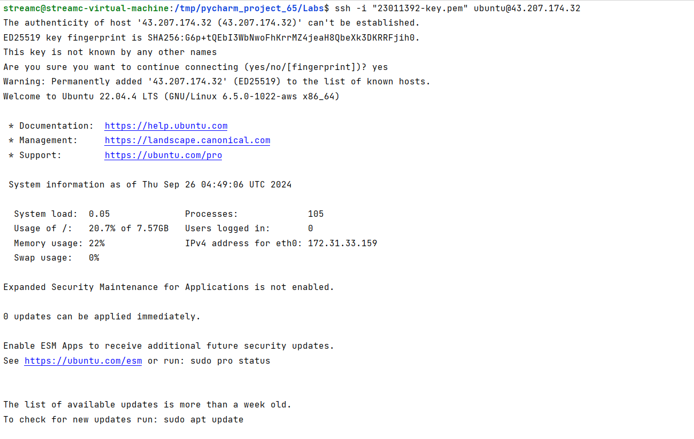

### [2] Search and open Identity Access Management

By following the instruction and open the Security Credentials tab under my user account, and obtained my Access Key ID and
the secret access key.

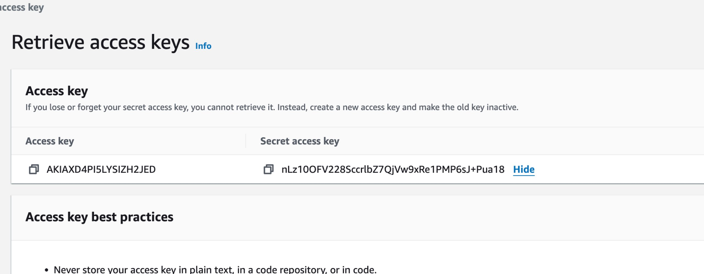
## Set up recent Linux OSes

My Operating System is macOS, so I use UTM as the virtual machine for booting Ubuntu.
## Install Linux packages

Linux VM has already been set up in my UTM, I don't need to re-install it.

### [1] Install Python 3.8.x

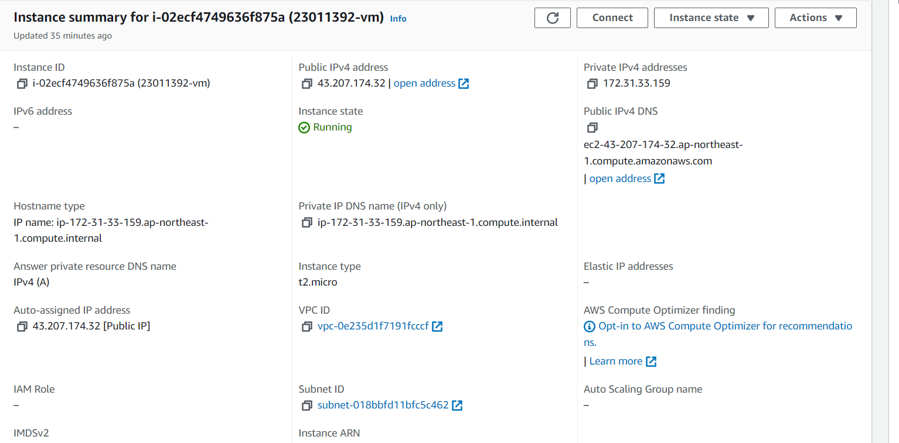
```bash
python3
```
By using this command line command, I found that my python version is 3.10.12, so I don't need to install python either.
### [2] Install awscli

By inputting the commands in the lab sheet, awscli has been successfully installed. I have already installed it, and checked 
by using the following command:
```bash
aws --version
```
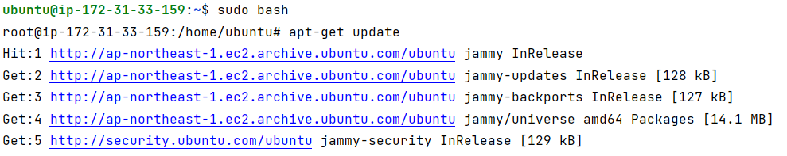
### [3] Configure AWS
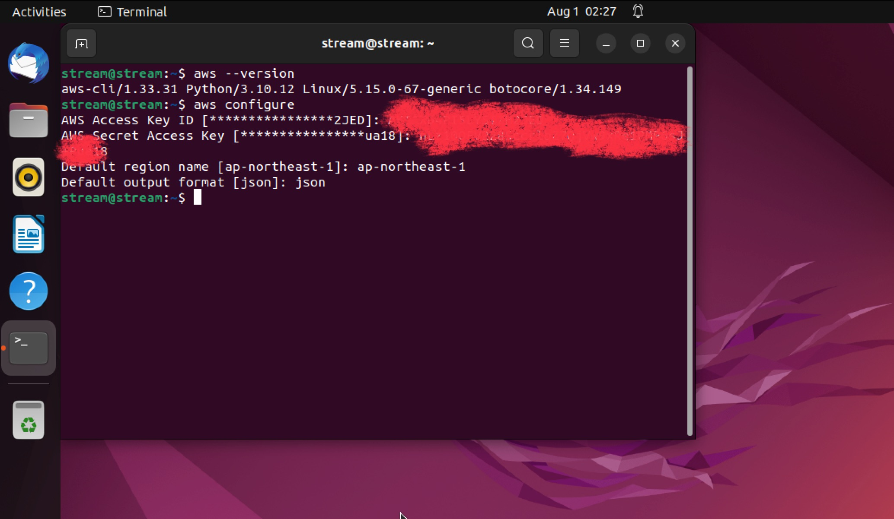
Input both the access keys obtained from Section [2] Search and open Identity Access Management, since my student number is
22984000 – 23370000, ap-northeast-1 would be my Region Name.

### [4] Install boto3

```bash
pip3 install boto3
pip show boto3
```
After running the command, boto3 had been successfully installed, 
using the second command to check whether it had been installed.
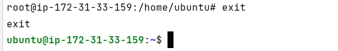

## Test the installed environment

### [1] Test the AWS environment

```bash
aws ec2 describe-regions --output table
```
The following table for running the command lists the available AWS regions for the EC2 service, with <span style="font-family: Courier;"> Endpoint, OptInStatus, 
RegionName </span>as columns.

* **Endpoint**: the URL for the EC2 service in the respective region;
* **OptInStatus**: Indicates whether the region requires opt-in for access. In this case no opt-in is needed;
* **RegionName**: The name of the AWS region.

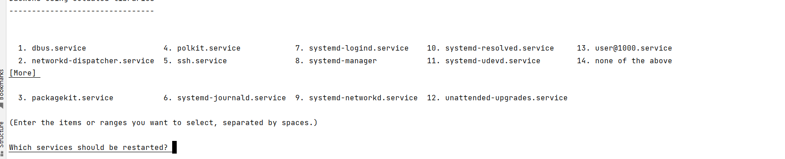
### [2] Test the Python environment

The script for testing python env used boto3 to create a client object for the EC2 service, and interact with EC2.
And called the <span style="font-family: Courier;"> describe_regions </span>method, retrieving a list of regions where EC2
services are available. The image below displays the output of the response, which contains 2 main parts:
#### **Regions**:
A list of dictionaries, each representing an AWS region, same as the previous table.

#### **ResponseMetaData**:
Metadata about the API request.
  
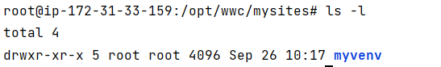
### [3] Write a Python script

The task only requires 2 columns, <span style="font-family: Courier;"> Endpoint, RegionName </span>, using Python's Pandas
library, converting the response into a pandas DataFrame and print in a tabulated format.

First by making sure that we have installed pandas, if not, using the following command to install.
```bash
pip3 install pandas
```

```python
import pandas as pd
import boto3

ec2 = boto3.client('ec2')
response = ec2.describe_regions()

regions = response['Regions']  # Ignore the Metadata since we don't necessarily need them.

df = pd.DataFrame(regions, columns=['Endpoint', 'RegionName'])  # In the Region dict, we only need Endpoint and RegionName as columns.

print(df)  # Print the tabulated data. 
```

The output: 

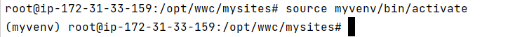
<div style="page-break-after: always;"></div>

# Lab 2

## Create an EC2 Instance

### [1] Create a security group
Type in the command `aws ec2 create-security-group --group-name 23011392-sg --description "security group for development environment"`
into the terminal of Ubuntu
- `23011392-sg`: The security group name that AWS created for me.
- `sg-03d9eeab7a30845e7`: The security group ID I received. 

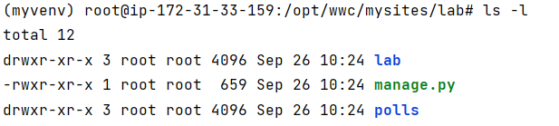

### [2] Authorise inbound traffic for ssh

Type in the command `aws ec2 authorize-security-group-ingress --group-name 23011392-sg --protocol tcp --port 22 --cidr 0.0.0.0/0`
- `"Return": true`: indicating that authorization was successful;
- `"SecurityGroupRules":[...]`: With a security group rule ID: "sgr-0b75b60eeee767008".


### [3] Create a key pair
```bash
stream@stream:~$ aws ec2 create-key-pair --key-name 23011392-key --query 'KeyMaterial' --output text > 23011392-key.pem

stream@stream:~$ chmod 400 23011392-key.pem
```

- `aws ec2 create-key-pair`: The command used to create a new key pair.
- `--output text > 23011392-key.pem`: Specify the output to be a plain text file and stored in a file named <span style="font-family: Courier;"> 23011392-key.pem </span>
on my local machine.
Create a key pair and set a permission after creating, restricting the permissions of the private key file so that only me can read it.

### [4] Create the instance
Since my student number is between 22984000 and 23370000, the ami_id should be <span style="font-family: Courier;"> ami-0162fe8bfebb6ea16 </span>
replace them with my student id and ami-id.
```bash
stream@stream:~$ aws ec2 run-instances --image-id ami-0162fe8bfebb6ea16 --security-group-ids 23011392-sg --count 1 --instance-type t2.micro --key-name 23011392-key --query 'Instances[0].InstanceId'
"i-0734269bd54fd6dd1"

 ```
The output `i-0734269bd54fd6dd1` is my instance ID that will be used in the next section.

### [5] Add a tag to your Instance

 ```
  aws ec2 create-tags --resources i-0734269bd54fd6dd1 --tags Key=Name,Value=23011392
 ```

### [6] Get the public IP address

```bash
stream@stream:~$ aws ec2 describe-instances --instance-ids i-0734269bd54fd6dd1 --query 'Reservations[0].Instances[0].PublicIpAddress'
"13.231.29.7"
```

`13.231.29.7` is my public IP address.

### [7] Connect to the instance via ssh
```bash
stream@stream:~$ ssh -i 23011392-key.pem ubuntu@13.231.29.7
The authenticity of host '13.231.29.7 (13.231.29.7)' can't be established.
ED25519 key fingerprint is SHA256:7NlgchZs5B8sNuMR8hp1ARtf4UQ9Kyplct0tKB8s0z4.
This key is not known by any other names
Are you sure you want to continue connecting (yes/no/[fingerprint])? yes
Warning: Permanently added '13.231.29.7' (ED25519) to the list of known hosts.
Welcome to Ubuntu 22.04.4 LTS (GNU/Linux 6.5.0-1022-aws x86_64)

 * Documentation:  https://help.ubuntu.com
 * Management:     https://landscape.canonical.com
 * Support:        https://ubuntu.com/pro

 System information as of Fri Aug  9 07:35:21 UTC 2024

  System load:  0.0               Processes:             97
  Usage of /:   20.7% of 7.57GB   Users logged in:       0
  Memory usage: 21%               IPv4 address for eth0: 172.31.40.211
  Swap usage:   0%

Expanded Security Maintenance for Applications is not enabled.

0 updates can be applied immediately.

Enable ESM Apps to receive additional future security updates.
See https://ubuntu.com/esm or run: sudo pro status


The list of available updates is more than a week old.
To check for new updates run: sudo apt update


The programs included with the Ubuntu system are free software;
the exact distribution terms for each program are described in the
individual files in /usr/share/doc/*/copyright.

Ubuntu comes with ABSOLUTELY NO WARRANTY, to the extent permitted by
applicable law.

To run a command as administrator (user "root"), use "sudo <command>".
See "man sudo_root" for details.

ubuntu@ip-172-31-40-211:~$ 
```
The command takes:
- `-i 23011392-key.pem`: The private key file to authenticate the ssh connection.
- `13.231.29.7`: The public IP address of my EC2 instance obtained from the last step.

Besides the welcome message, I also received some system information confirming that I logged into the EC2 instance.

### [8] List the created instance using the AWS console

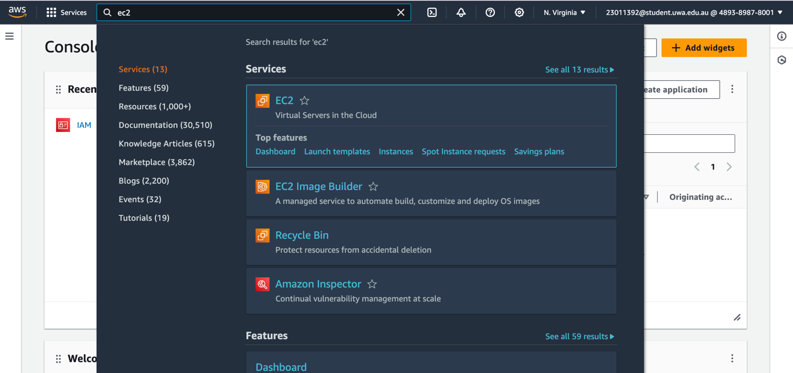

Starting by opening the web browser of AWS Management Console and go to the Instances under the Dashboard.

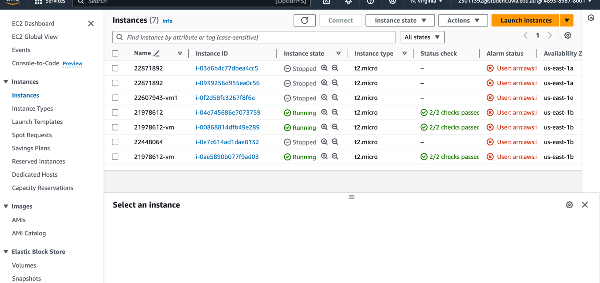

## Create an EC2 instance with Python Boto3

Based on the command line commands in the previous section and the python document of boto3, I found some similar functions in the
boto3 library that have the same effects as command line.
```python
import boto3
from botocore.exceptions import ClientError

# Create EC2 client based on my region associated with my student number
ec2 = boto3.client('ec2', region_name='ap-northeast-1')

# Check if security group exists, if not create it
try:
    response = ec2.describe_security_groups(GroupNames=['23011392-sg'])
    security_group_id = response['SecurityGroups'][0]['GroupId']
    print(f"Using existing security group: {security_group_id}")
except ClientError as e:
    if e.response['Error']['Code'] == 'InvalidGroup.NotFound':
        print("Creating new security group")
        security_group = ec2.create_security_group(
            GroupName='23011392-sg',
            Description='security group for development environment'
        )
        security_group_id = security_group['GroupId']

        # Authorize inbound SSH traffic
        ec2.authorize_security_group_ingress(
            GroupId=security_group_id,
            IpProtocol='tcp',
            FromPort=22,
            ToPort=22,
            CidrIp='0.0.0.0/0'
        )
    else:
        raise e

# Check if key pair exists, if not create it
try:
    ec2.describe_key_pairs(KeyNames=['23011392-key'])
    print("Key pair already exists")
except ClientError as e:
    if e.response['Error']['Code'] == 'InvalidKeyPair.NotFound':
        print("Creating new key pair")
        key_pair = ec2.create_key_pair(KeyName='23011392-key')
        with open('23011392-key.pem', 'w') as key_file:
            key_file.write(key_pair['KeyMaterial'])
    else:
        raise e

# Create EC2 instance
instance = ec2.run_instances(
    ImageId='ami-0162fe8bfebb6ea16',
    InstanceType='t2.micro',
    KeyName='23011392-key',
    SecurityGroupIds=[security_group_id],
    MinCount=1,
    MaxCount=1
)

instance_id = instance['Instances'][0]['InstanceId']

# Add tag to instance
ec2.create_tags(
    Resources=[instance_id],
    Tags=[{'Key': 'Name', 'Value': '23011392'}]
)

# Get public IP address
response = ec2.describe_instances(InstanceIds=[instance_id])
public_ip = response['Reservations'][0]['Instances'][0]['PublicIpAddress']

print(f"Instance created with ID: {instance_id}")
print(f"Public IP address: {public_ip}")
```

### Functions I have used:
- dfd
- df
- TODO
## Use Docker inside a Linux OS

### [1] Install Docker
```
sudo apt install docker.io -y
```

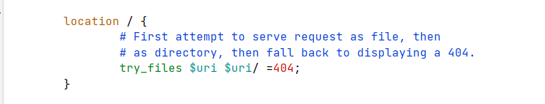

The image illustrates that Docker has been installed in my VM, with the newest version(24.0.7)

### [2] Start Docker
```
sudo systemctl start docker
```

### [3] Enable Docker
```
sudo systemctl enable docker
```

After running previous 3 commands, Docker has been successfully installed and enabled on my VM.


### [5] Build and run an httpd container 

Create two files according to the lab sheet:

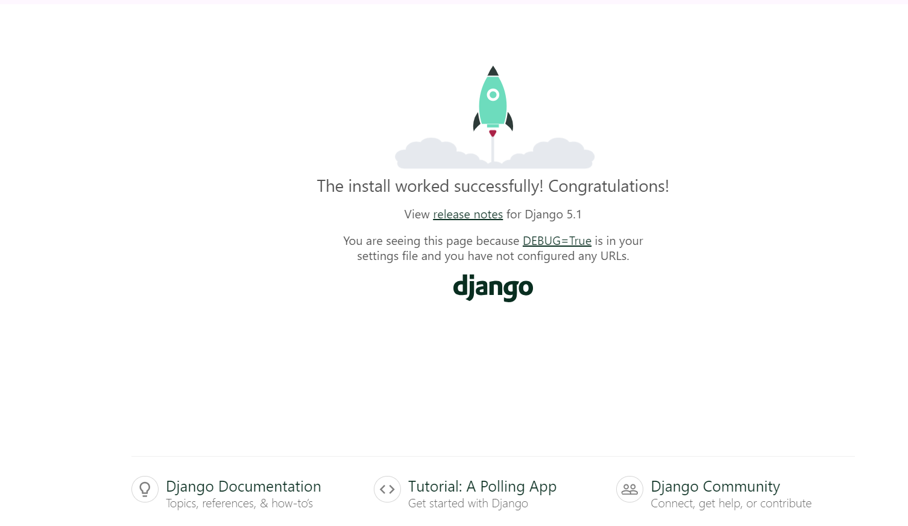


A permission error raised, try `sudo usermod -a -G docker <username>` and rebuild the docker image using `docker build -t my-apache2 .`: 
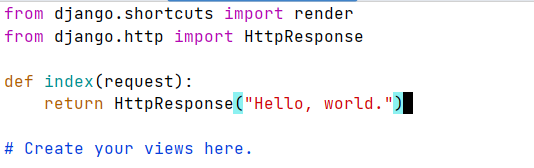
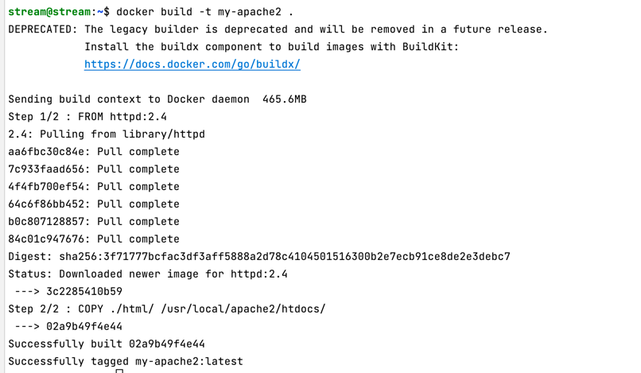

Since I am using PyCharm's SSH linking to my VM, I typed `exit` in the terminal to logout of SSH and logged back in using
`ssh stream@<my_vmserver_ip>`

After that, after running the image using `docker run -p 80:80 -dit --name my-app my-apache2` and open the browser with URL for my VM's IP, the following 
page has been displayed. 
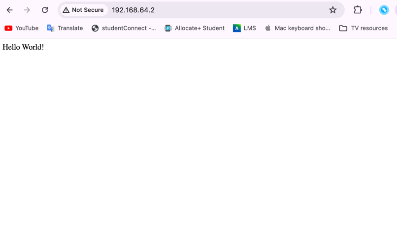

### [6] Other docker commands
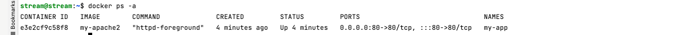
By running `docker ps -a`, I there are a bunch of information I can gather:
- Container ID: e3e2cf9c58f8
- Image: my-apache2
- Command: The container is running the <span style="font-family: Courier;"> httpd-foreground </span> command
- Created & Status: The container was created 4 mins ago and has been running for 4 mins.
- Ports: Port 80 inside the container is mapped to the port 80 on my host machine
- Names: The container is named my-app

After the container is stopped, the status of it became <span style="font-family: Courier;"> Exited </span>
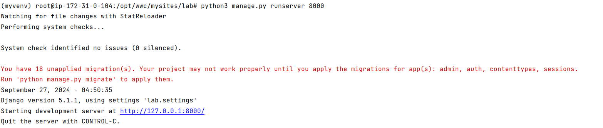

Same as removing the container, after removing the container it will no longer be listed in the containers.
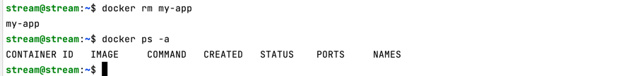

# Lab 3

<div style="page-break-after: always;"></div>

# Lab 4

<div style="page-break-after: always;"></div>

# Lab 5

