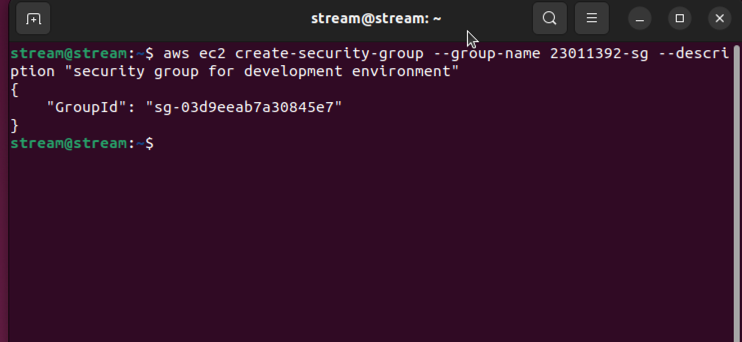
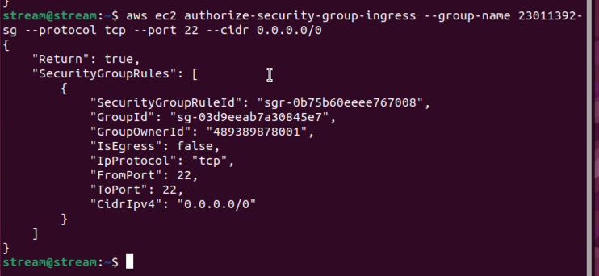

<div style="display: flex; flex-direction: column; justify-content: center; align-items: center; height: 100vh;">

  <h2>Labs 1-5</h2>
  
  <p>Student ID: 23011392</p>
  <p>Student Name: Xiaojun Huang</p>

</div>

# Lab 1

## AWS Account and Log in

### [1] Log into an IAM user account created for you on AWS.

Starting by opening the URL provided in lab sheet 1, input the account and password as mentioned in the email. After logining
into the home page, change the password of my account immediately.


### [2] Search and open Identity Access Management

By following the instruction and open the Security Credentials tab under my user account, and obtained my Access Key ID and
the secret access key.


## Set up recent Linux OSes

My Operating System is macOS, so I use UTM as the virtual machine for booting Ubuntu.
## Install Linux packages

Linux VM has already been set up in my UTM, I don't need to re-install it.

### [1] Install Python 3.8.x


```bash
python3
```
By using this command line command, I found that my python version is 3.10.12, so I don't need to install python either.
### [2] Install awscli

By inputting the commands in the lab sheet, awscli has been successfully installed. I have already installed it, and checked 
by using the following command:
```bash
aws --version
```

### [3] Configure AWS

Input both the access keys obtained from Section [2] Search and open Identity Access Management, since my student number is
22984000 – 23370000, ap-northeast-1 would be my Region Name.

### [4] Install boto3

```bash
pip3 install boto3
pip show boto3
```
After running the command, boto3 had been successfully installed, 
using the second command to check whether it had been installed.


## Test the installed environment

### [1] Test the AWS environment

```bash
aws ec2 describe-regions --output table
```
The following table for running the command lists the available AWS regions for the EC2 service, with <span style="font-family: Courier;"> Endpoint, OptInStatus, 
RegionName </span>as columns.

* **Endpoint**: the URL for the EC2 service in the respective region;
* **OptInStatus**: Indicates whether the region requires opt-in for access. In this case no opt-in is needed;
* **RegionName**: The name of the AWS region.


### [2] Test the Python environment

The script for testing python env used boto3 to create a client object for the EC2 service, and interact with EC2.
And called the <span style="font-family: Courier;"> describe_regions </span>method, retrieving a list of regions where EC2
services are available. The image below displays the output of the response, which contains 2 main parts:
#### **Regions**:
A list of dictionaries, each representing an AWS region, same as the previous table.

#### **ResponseMetaData**:
Metadata about the API request.
  

### [3] Write a Python script

The task only requires 2 columns, <span style="font-family: Courier;"> Endpoint, RegionName </span>, using Python's Pandas
library, converting the response into a pandas DataFrame and print in a tabulated format.

First by making sure that we have installed pandas, if not, using the following command to install.
```bash
pip3 install pandas
```

```python
import pandas as pd
import boto3

ec2 = boto3.client('ec2')
response = ec2.describe_regions()

regions = response['Regions']  # Ignore the Metadata since we don't necessarily need them.

df = pd.DataFrame(regions, columns=['Endpoint', 'RegionName'])  # In the Region dict, we only need Endpoint and RegionName as columns.

print(df)  # Print the tabulated data. 
```

The output: 


<div style="page-break-after: always;"></div>

# Lab 2

## Create an EC2 Instance

### [1] Create a security group
Type in the command `aws ec2 create-security-group --group-name 23011392-sg --description "security group for development environment"`
into the terminal of Ubuntu
- `23011392-sg`: The security group name that AWS created for me.
- `sg-03d9eeab7a30845e7`: The security group ID I received. 



### [2] Authorise inbound traffic for ssh

Type in the command `aws ec2 authorize-security-group-ingress --group-name 23011392-sg --protocol tcp --port 22 --cidr 0.0.0.0/0`
- `"Return": true`: indicating that authorization was successful;
- `"SecurityGroupRules":[...]`: With a security group rule ID: "sgr-0b75b60eeee767008".


### [3] Create a key pair
```
stream@stream:~$ aws ec2 create-key-pair --key-name 23011392-key --query 'KeyMaterial' --output text > 23011392-key.pem

stream@stream:~$ chmod 400 23011392-key.pem
```

- `aws ec2 create-key-pair`: The command used to create a new key pair.
- `--output text > 23011392-key.pem`: Specify the output to be a plain text file and stored in a file named <span style="font-family: Courier;"> 23011392-key.pem </span>
on my local machine.
Create a key pair and set a permission after creating, restricting the permissions of the private key file so that only me can read it.

### [4] Create the instance
Since my student number is between 22984000 and 23370000, the ami_id should be <span style="font-family: Courier;"> ami-0162fe8bfebb6ea16 </span>
then. 
```
 aws ec2 run-instances --image-id ami-0162fe8bfebb6ea16 --security-group-ids 23011392-sg --count 1 --instance-type t2.micro --key-name 23011392-key --query 'Instances[0].InstanceId'

 ```
# Lab 3

<div style="page-break-after: always;"></div>

# Lab 4

<div style="page-break-after: always;"></div>

# Lab 5

