<div style="display: flex; flex-direction: column; justify-content: center; align-items: center; height: 100vh;">

  <h2>Labs 6-9</h2>
  
  <p>Student ID: 23011392</p>
  <p>Student Name: Xiaojun Huang</p>

</div>

# Lab 6

## Set up an EC2 instance

### [1] Create an EC2 micro instance with Ubuntu and SSH into it. 
Same as the Lab 5, this time I create EC2 micro instance in the AWS console with Security Group and secret key. 


The local key file is stored under the dir in the image, with public IP addr of my instance in the command.

### [2] Install the Python 3 virtual environment package. 

Since all the operation require root user authentication. I changed the mode to root mode using `sudo bash`.


After I typed in `apt-get upgrade` following content popped out, the system requires me to select services needed to restart.
In this case I selected ssh.service(5), preventing accidentally connection lost. 


Last, install python3 venv using `apt-get install python3-venv`.


### [3] Access a directory 

`-p` option will create necessary parent dirs automatically. 

```bash
mkdir -p /opt/wwc/mysites
cd /opt/wwc/mysites
```

### [4] Set up a virtual environment


`python3 -m venv myvenv`


After running this command, a subdir named `myvenv` was created.

### [5] Activate the virtual environment

```bash
source myvenv/bin/activate

pip install django

django-admin startproject lab

cd lab

python3 manage.py startapp polls
```

After running the first line, there is a (myvenv) before my username, indicating the activation of virtual environment was successful.


For the rest of the command line commands, first install Django using `pip install django`, and create a new Django project named `lab`, and
change into the directory. Last I used `python3 manage.py startapp polls` to create a new Django app named `polls` within my `lab` project. 
 dir named `polls` will be created inside the `lab` dir. 


### [6] Install nginx

```apt install nginx```
Following windows popped out when I typed in the command, requires me to select services to restart. I choose to continue without restarting
any services.


### [7] Configure nginx


For the server section, according to the lab sheet I only need the first two rows, and Location subsection. Delete the rest. Same for Location.


### [8] Restart nginx

Type in the command `service nginx restart` to restart nginx after modifying the `default` file.

### [9] Access your EC2 instance

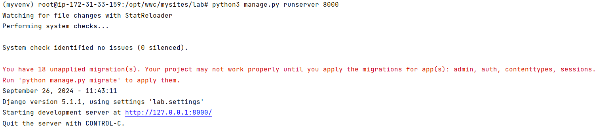

Run `manage.py` in the directory I changed to using command `python3 manage.py runserver 8000`, the message popped out.

Open the via a browser:


The welcome page of Django indicates that my Django server is running successfully. 

## Set up Django inside the created EC2 instance

### [1] Edit the following files (create them if not exist)


Open `polls/views.py` and the rest, add the content in the lab sheet into it.

### [2] Run the web server again


### [3] Access the EC2 instance

I accessed my instance's IP address with endpoint `/polls` `http://18.183.253.227/polls/`, the page only contains a line of text saying 'Hello, world.'


## Set up an ALB

### [1] Create an application load balancer

First go to the AWS Console, and navigate to the corresponding section:

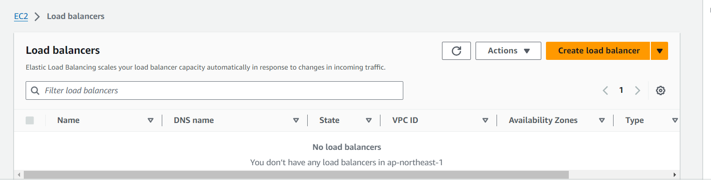

Click the `Create Load Balancer` button and choose the "Application Load Balancer". Create as follows, with the security group and target group of my instance.

Create the ALB after everything is set up.

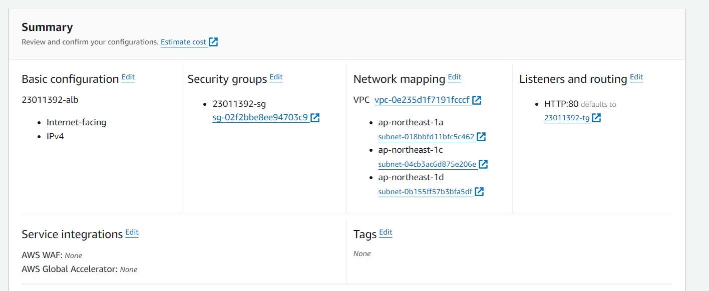

### [2] Health check

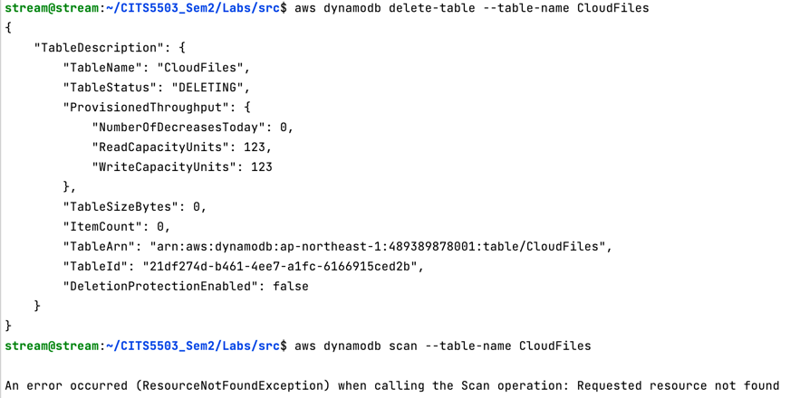

For the target group associated with my ALB, navigate to "Target Groups" under "Load Balancing" section in the AWS console, and find the target group 
I created. Edit it in the "Health Check" tab to change the tab from `/` to `/polls/`. The interval here is already 30s, indicates the health check fetches
the page every 30s.

### [3] Access

Delete the instance and ALB created after complete the lab.

# Lab 7

### [Step 1] Create an EC2 instance

Similar to the previous labs, use the code to create an EC2 instance so that I can do operations later on:
```python3
import boto3
from botocore.exceptions import ClientError

# Create EC2 client based on my region associated with my student number
ec2 = boto3.client('ec2', region_name='ap-northeast-1')

# Check if security group exists, if not create it
try:
    response = ec2.describe_security_groups(GroupNames=['23011392-sg'])
    security_group_id = response['SecurityGroups'][0]['GroupId']
    print(f"Using existing security group: {security_group_id}")
except ClientError as e:
    if e.response['Error']['Code'] == 'InvalidGroup.NotFound':
        print("Creating new security group")
        security_group = ec2.create_security_group(
            GroupName='23011392-sg',
            Description='security group for development environment'
        )
        security_group_id = security_group['GroupId']

        # Authorize inbound SSH and HTTP traffic
        ec2.authorize_security_group_ingress(
            GroupId=security_group_id,
            IpProtocol='tcp',
            FromPort=22,
            ToPort=22,
            CidrIp='0.0.0.0/0'
        )
        ec2.authorize_security_group_ingress(
            GroupId=security_group_id,
            IpProtocol='tcp',
            FromPort=80,
            ToPort=80,
            CidrIp='0.0.0.0/0'
        )
    else:
        raise e

# Check if key pair exists, if not create it
try:
    ec2.describe_key_pairs(KeyNames=['23011392-key'])
    print("Key pair already exists")
except ClientError as e:
    if e.response['Error']['Code'] == 'InvalidKeyPair.NotFound':
        print("Creating new key pair")
        key_pair = ec2.create_key_pair(KeyName='23011392-key')
        with open('23011392-key.pem', 'w') as key_file:
            key_file.write(key_pair['KeyMaterial'])
    else:
        raise e

# Create EC2 instance
instance = ec2.run_instances(
    ImageId='ami-0162fe8bfebb6ea16',
    InstanceType='t2.micro',
    KeyName='23011392-key',
    SecurityGroupIds=[security_group_id],
    MinCount=1,
    MaxCount=1
)

instance_id = instance['Instances'][0]['InstanceId']

# Add tag to instance
ec2.create_tags(
    Resources=[instance_id],
    Tags=[{'Key': 'Name', 'Value': '23011392-vm1'}]
)

# Get public IP address
response = ec2.describe_instances(InstanceIds=[instance_id])
public_ip = response['Reservations'][0]['Instances'][0]['PublicIpAddress']

print(f"Instance created with ID: {instance_id}")
print(f"Public IP address: {public_ip}")
```
### [Step 2] Install and configure Fabric on your VM

Starting from installing fabric via the command `pip install fabric`, and create a config file inside "~/.ssh":

`vim ~/.ssh/congig`

``` 
Host 23011392-vm1
	Hostname ec2-18-183-253-227.ap-northeast-1.compute.amazonaws.com
	User ubuntu
	UserKnownHostsFile /dev/null
	StrictHostKeyChecking no
	PasswordAuthentication no
	IdentityFile /home/streamc/Desktop/Labs/23011392-key.pem

```

same as previous labs, connect to my created EC2 instance using ssh:

`ssh -i 23011392-key.pem ubuntu@18.183.253.227`

Last, test the following python code locally, successfully output "Linux":

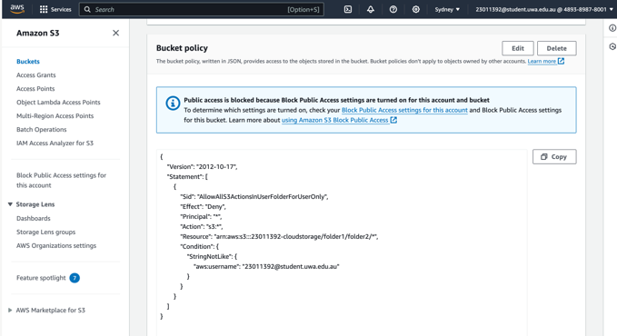


### [Step 3] Write a python script to automate the installation of nginx

```python
import io

from fabric import Connection


c = Connection('23011392-vm1')


def setup_nginx(c):
    """"""

    # Update the packet list
    c.sudo('apt-get update')

    # Install nginx
    c.sudo('apt-get install -y nginx')

    # Start nginx service
    c.sudo('systemctl start nginx')

    # Enable nginx to start on boot
    c.sudo('systemctl enable nginx')

    # Configure nginx
    nginx_config = '''
       server {
          listen 80 default_server;
          listen [::]:80 default_server;
        
          location / {
            proxy_set_header X-Forwarded-Host $host;
            proxy_set_header X-Real-IP $remote_addr;
        
            proxy_pass http://127.0.0.1:8000;
          }
        }
       '''

    # Write the nginx configuration
    config_file = io.StringIO(nginx_config)
    c.put(config_file, '/tmp/nginx_config')
    c.sudo('mv /tmp/nginx_config /etc/nginx/sites-available/default')

    # Restart nginx to apply changes
    c.sudo('systemctl restart nginx')

    print("Nginx has been installed and configured.")


if __name__ == '__main__':
    setup_nginx(c)
```

### Step[4] Use Fabric for Automation

Starting from updating my script in step[3].

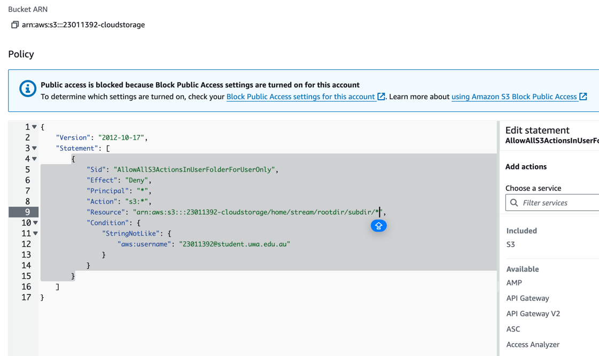

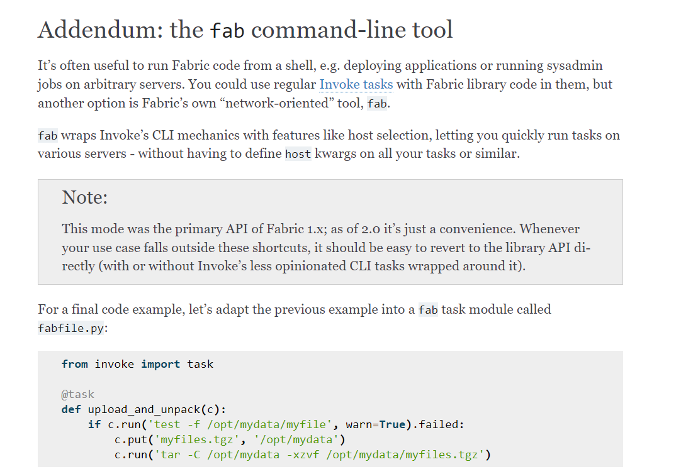

# Lab 8

## Set Up Python Environment
Starting from installing pandas, numpy, jupyter notebook, and sagemaker.

## Prepare SageMaker session

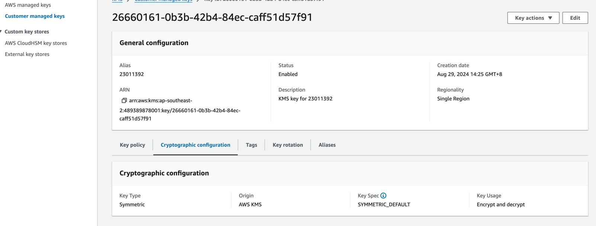

The first time I execute the Jupyter Notebook script and a NoSuchEntity exception raised, and I found in the IAM roles there 
is no role named `Role_AWS_SageMaker`. So I viewed the role list and found the closest one: `SageMakerRole`.

## Download Dataset

Answer the following questions:
    - Which variables are categorical?
Categorical variables are usually non-numerical and represent catagory labels: `job`, `marital`, `education`, `default`, `housing`, 
`loan`, `contact`, `month`, `day_of_week`, `poutcome`, `y`
    - Which ones are numerical?
Continuous or discrete numbers in the dataset: `age`, `duration`, `campaign`, `pdays`, `previous`, `emp.var.rate`, `cons.price.idx`, 
`cons.conf.idx`, `euribor3m`, `nr.employed`.

```python
boto3.Session().resource("s3").Bucket(bucket).Object(
    os.path.join(prefix, "train/train.csv")
).upload_file("train.csv")
boto3.Session().resource("s3").Bucket(bucket).Object(
    os.path.join(prefix, "validation/validation.csv")
).upload_file("validation.csv")
```

In this python script, it uploads the training and validation file into my S3 bucket.

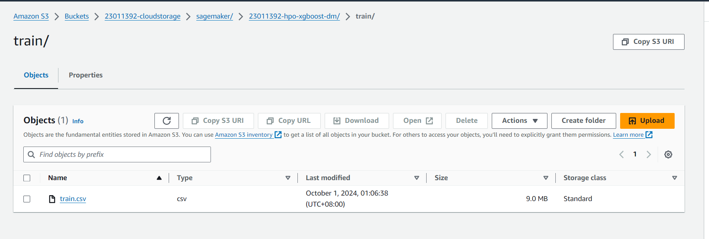

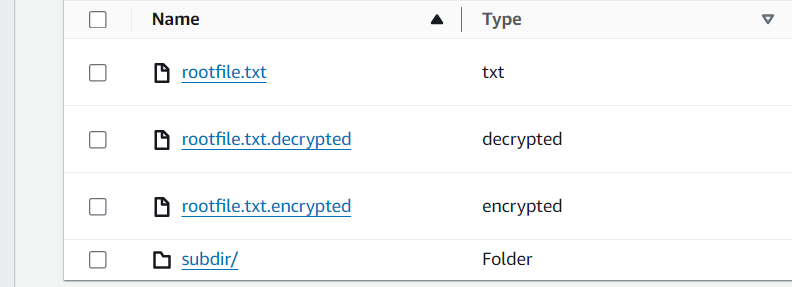

After executing all the code blocks in the Jupyter Notebook, there are two tuning jobs of me created inside the AWS
SageMaker under the Training-Hyperparameter tuning jobs list, two training with status 'in progress'.

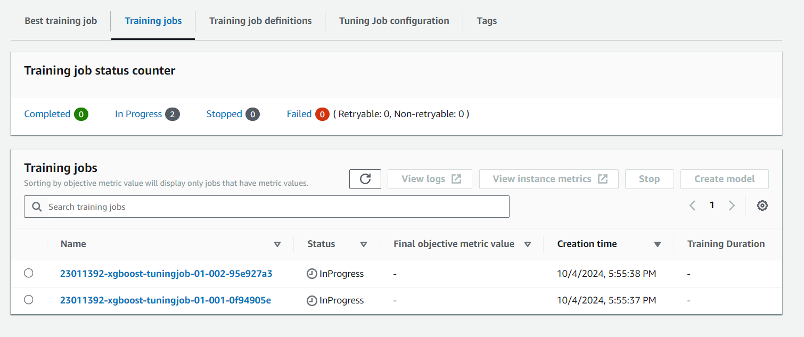

And two training jobs became 'failed' afterward. 

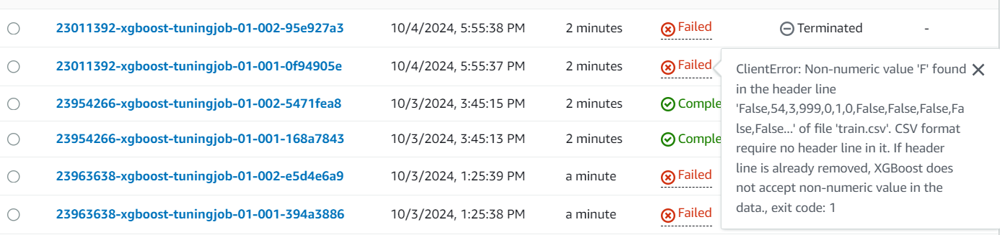

Since all value inside the dataset must be non-numeric value, I converted True/False to 1/0 in the dataset in the preprocessing stage, and ran the 
training once again until completed. 

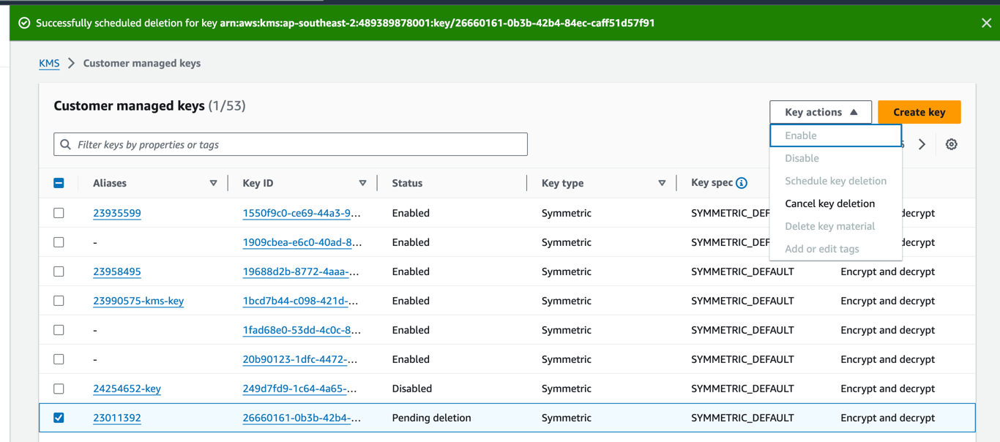

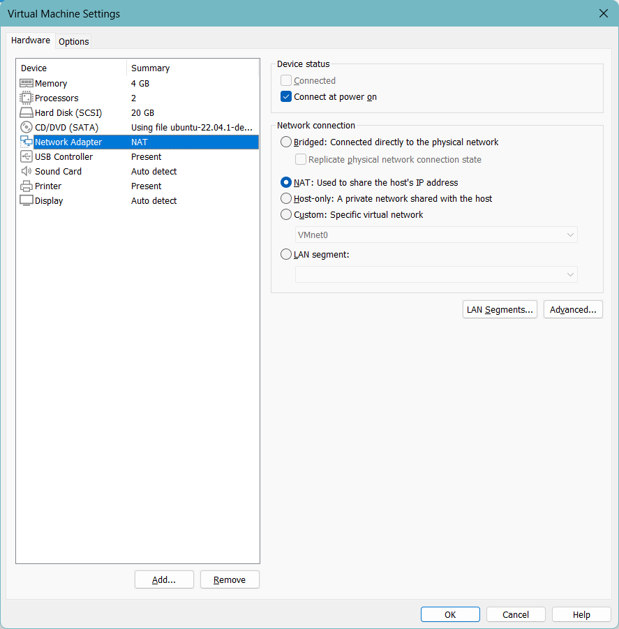

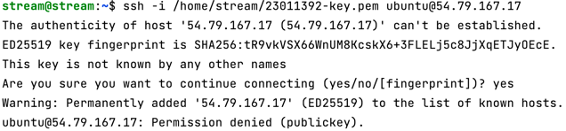

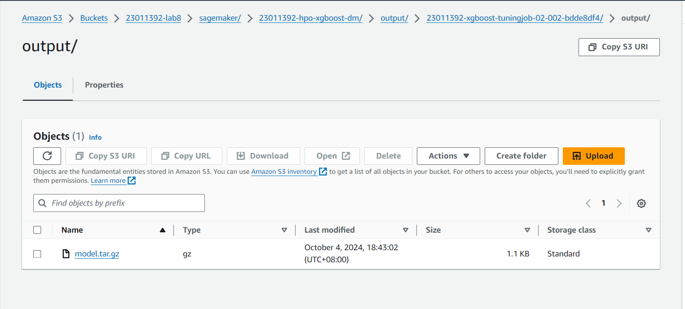

Delete the S3 bucket after the lab is finished.


# Lab 9


## Detect Languages from text

```python
import sys

import boto3
client = boto3.client('comprehend')

language_mapping = { # Map the language code to specific language
    'en': 'English',
    'es': 'Spanish',
    'fr': 'French',
    'it': 'Italian',
}

def detect_language(text):
    # Detect Entities
    response = client.detect_dominant_language(
        Text=text
    )

    languages = response['Languages']

    for language in languages:
        lang_code = language['LanguageCode']
        confidence = language['Score'] * 100

        # Access the language mapping via code, if not in the dict the code will be output.
        predicted_language = language_mapping.get(lang_code, lang_code)

        print(f"{predicted_language} detected with {confidence:.2f}% confidence")

if __name__ == '__main__':
    text = input("Input text: ")
    detect_language(text)
```

In my code, I integrated the function `detect_dominant_language()` inside my custom function. In the output of the response, I extracted the 'Language' field in the response.
Inside this dictionary, we only interested in the language code and confidence(score). Since the output language of boto3 comprehend is in the code format, we need a mapping 
to convert the code of language to plain English. When I tried with another languages:

```bash
/home/streamc/.virtualenvs/CITS5503_Sem2/bin/python /home/streamc/Desktop/Labs/src/lab9.py 
Input text: El Quijote es la obra más conocida de Miguel de Cervantes Saavedra. Publicada su primera parte con el título de El ingenioso hidalgo don Quijote de la Mancha a comienzos de 1605, es una de las obras más destacadas de la literatura española y la literatura universal, y una de las más traducidas. En 1615 aparecería la segunda parte del Quijote de Cervantes con el título de El ingenioso caballero don Quijote de la Mancha.
El Quijote es la obra más conocida de Miguel de Cervantes Saavedra. Publicada su primera parte con el título de El ingenioso hidalgo don Quijote de la Mancha a comienzos de 1605, es una de las obras más destacadas de la literatura española y la literatura universal, y una de las más traducidas. En 1615 aparecería la segunda parte del Quijote de Cervantes con el título de El ingenioso caballero don Quijote de la Mancha.
Spanish detected with 99.92% confidence
```

```bash
/home/streamc/.virtualenvs/CITS5503_Sem2/bin/python /home/streamc/Desktop/Labs/src/lab9.py 
Input text: Moi je n'étais rien Et voilà qu'aujourd'hui Je suis le gardien Du sommeil de ses nuits Je l'aime à mourir Vous pouvez détruire Tout ce qu'il vous plaira Elle n'a qu'à ouvrir L'espace de ses bras Pour tout reconstruire Pour tout reconstruire Je l'aime à mourir
Moi je n'étais rien Et voilà qu'aujourd'hui Je suis le gardien Du sommeil de ses nuits Je l'aime à mourir Vous pouvez détruire Tout ce qu'il vous plaira Elle n'a qu'à ouvrir L'espace de ses bras Pour tout reconstruire Pour tout reconstruire Je l'aime à mourir
French detected with 99.88% confidence
```

```bash
/home/streamc/.virtualenvs/CITS5503_Sem2/bin/python /home/streamc/Desktop/Labs/src/lab9.py 
Input text: L'amor che move il sole e l'altre stelle.
L'amor che move il sole e l'altre stelle.
Italian detected with 99.65% confidence
```

From the output above, the program does execute and generate correct output with high confidence within the integration of `detect_dominant_language()` in the `comprehend`
module. 

## Analyze sentiment

We are using the `detect_sentiment()` function in AWS `comprehend` module. 

```python
import sys

import boto3
client = boto3.client('comprehend')

language_mapping = { # Map the language code to specific language
    'en': 'English',
    'es': 'Spanish',
    'fr': 'French',
    'it': 'Italian',
}

def detect_language(text):
    # Detect Entities
    response = client.detect_dominant_language(
        Text=text
    )

    languages = response['Languages']

    for language in languages:
        lang_code = language['LanguageCode']
        confidence = language['Score'] * 100

        # Access the language mapping via code, if not in the dict the code will be output.
        predicted_language = language_mapping.get(lang_code, lang_code)

        print(f"{predicted_language} detected with {confidence:.2f}% confidence")

        return lang_code


def analyze_sentiment(text, language_code):
    response = client.detect_sentiment(Text=text, LanguageCode=language_code)

    sentiment = response['Sentiment']
    sentiment_scores = response['SentimentScore']

    print(f"Sentiment: {sentiment}")
    print(f"Confidence scores: Positive: {sentiment_scores['Positive']:.2f},"
          f"Negative: {sentiment_scores['Negative']:.2f}, "
          f"Neutral: {sentiment_scores['Neutral']:.2f}, "
          f"Mixed: {sentiment_scores['Mixed']:.2f}")

if __name__ == '__main__':
    text = input("Input text: ")
    code = detect_language(text)
    analyze_sentiment(text, code)
```
In my code, I start from obtaining the language code by the previous function. After that, I use AWS's `detect_sentiment()` function in boto3 to detect sentiment
of the text using its language code. In the response, I access the sentiment via the 'Sentiment' key in the response dict,
and obtained the sentiment scores via the sub-dict 'SentimentScore' for each sentiment.

```bash
/home/streamc/.virtualenvs/CITS5503_Sem2/bin/python /home/streamc/Desktop/Labs/src/lab9.py 
Input text: The French Revolution was a period of social and political upheaval in France and its colonies beginning in 1789 and ending in 1799.
The French Revolution was a period of social and political upheaval in France and its colonies beginning in 1789 and ending in 1799.
English detected with 99.84% confidence
Sentiment: NEUTRAL
Confidence scores: Positive: 0.00,Negative: 0.00, Neutral: 1.00, Mixed: 0.00
```

```bash
/home/streamc/.virtualenvs/CITS5503_Sem2/bin/python /home/streamc/Desktop/Labs/src/lab9.py 
Input text: El Quijote es la obra más conocida de Miguel de Cervantes Saavedra. Publicada su primera parte con el título de El ingenioso hidalgo don Quijote de la Mancha a comienzos de 1605, es una de las obras más destacadas de la literatura española y la literatura universal, y una de las más traducidas. En 1615 aparecería la segunda parte del Quijote de Cervantes con el título de El ingenioso caballero don Quijote de la Mancha.
El Quijote es la obra más conocida de Miguel de Cervantes Saavedra. Publicada su primera parte con el título de El ingenioso hidalgo don Quijote de la Mancha a comienzos de 1605, es una de las obras más destacadas de la literatura española y la literatura universal, y una de las más traducidas. En 1615 aparecería la segunda parte del Quijote de Cervantes con el título de El ingenioso caballero don Quijote de la Mancha.
Spanish detected with 99.92% confidence
Sentiment: NEUTRAL
Confidence scores: Positive: 0.02,Negative: 0.00, Neutral: 0.98, Mixed: 0.00
```

```bash
/home/streamc/.virtualenvs/CITS5503_Sem2/bin/python /home/streamc/Desktop/Labs/src/lab9.py 
Input text: Moi je n'étais rien Et voilà qu'aujourd'hui Je suis le gardien Du sommeil de ses nuits Je l'aime à mourir Vous pouvez détruire Tout ce qu'il vous plaira Elle n'a qu'à ouvrir L'espace de ses bras Pour tout reconstruire Pour tout reconstruire Je l'aime à mourir
Moi je n'étais rien Et voilà qu'aujourd'hui Je suis le gardien Du sommeil de ses nuits Je l'aime à mourir Vous pouvez détruire Tout ce qu'il vous plaira Elle n'a qu'à ouvrir L'espace de ses bras Pour tout reconstruire Pour tout reconstruire Je l'aime à mourir
French detected with 99.88% confidence
Sentiment: POSITIVE
Confidence scores: Positive: 0.96,Negative: 0.01, Neutral: 0.00, Mixed: 0.02
```

```bash
/home/streamc/.virtualenvs/CITS5503_Sem2/bin/python /home/streamc/Desktop/Labs/src/lab9.py 
Input text: L'amor che move il sole e l'altre stelle.
L'amor che move il sole e l'altre stelle.
Italian detected with 99.65% confidence
Sentiment: POSITIVE
Confidence scores: Positive: 1.00,Negative: 0.00, Neutral: 0.00, Mixed: 0.00
```

## Detect entities

Use the function `detect_entites()` in AWS Comprehend to detect entities in the text.

```python

import boto3
client = boto3.client('comprehend')

language_mapping = { # Map the language code to specific language
    'en': 'English',
    'es': 'Spanish',
    'fr': 'French',
    'it': 'Italian',
}

def detect_language(text):
    # Detect Entities
    response = client.detect_dominant_language(
        Text=text
    )

    languages = response['Languages']

    for language in languages:
        lang_code = language['LanguageCode']
        confidence = language['Score'] * 100

        # Access the language mapping via code, if not in the dict the code will be output.
        predicted_language = language_mapping.get(lang_code, lang_code)

        print(f"{predicted_language} detected with {confidence:.2f}% confidence")

        return lang_code


def detect_entities(text, language_code):
    # Call the AWS Comprehend API for entity detection
    response = client.detect_entities(Text=text, LanguageCode=language_code)

    # Get the detected entities from the response
    entities = response['Entities']

    # Print the detected entities with their types and confidence scores
    print(f"Detected entities in the text:")
    for entity in entities:
        entity_text = entity['Text']
        entity_type = entity['Type']
        confidence = entity['Score'] * 100  # Convert score to percentage
        print(f"Entity: {entity_text}, Type: {entity_type}, Confidence: {confidence:.2f}%")


if __name__ == '__main__':
    # Example texts (you can replace these with other texts in different languages)
    english_text = "The French Revolution was a period of social and political upheaval in France and its colonies beginning in 1789 and ending in 1799."
    spanish_text = "El Quijote es la obra más conocida de Miguel de Cervantes Saavedra."
    french_text = "Moi je n'étais rien Et voilà qu'aujourd'hui Je suis le gardien Du sommeil de ses nuits."
    italian_text = "L'amor che move il sole e l'altre stelle."

    # Detect entities for each language text
    print("English Entities Detection:")
    detect_entities(english_text, language_code=detect_language(english_text))

    print("\nSpanish Entities Detection:")
    detect_entities(spanish_text, language_code=detect_language(spanish_text))

    print("\nFrench Entities Detection:")
    detect_entities(french_text, language_code=detect_language(french_text))

    print("\nItalian Entities Detection:")
    detect_entities(italian_text, language_code=detect_language(italian_text))
```

```bash
/home/streamc/.virtualenvs/CITS5503_Sem2/bin/python /home/streamc/Desktop/Labs/src/lab9.py 
English Entities Detection:
Detected entities in the text:
Entity: French Revolution, Type: EVENT, Confidence: 98.60%
Entity: France, Type: LOCATION, Confidence: 98.98%
Entity: 1789, Type: DATE, Confidence: 99.80%
Entity: 1799, Type: DATE, Confidence: 99.87%

Spanish Entities Detection:
Detected entities in the text:
Entity: El Quijote, Type: TITLE, Confidence: 98.30%
Entity: Miguel de Cervantes Saavedra, Type: PERSON, Confidence: 99.94%

French Entities Detection:
Detected entities in the text:
Entity: aujourd'hui, Type: DATE, Confidence: 99.24%

Italian Entities Detection:
Detected entities in the text:
```

In my python script, the `detect_entities()` function also requires the language code for the source language. Inside my 
function, I used the 'Entities' sub-dict from the response of it. Inside the list, `entity_text` is the name of the entity,
`entity_type` is the type of the entity, along with its confidence. From the output, take English as an example, we can see 
the output is correct. 

### describe what entities are in your own words.

In NLP, entities refer to an object within a text that has distinct meaning. Common entities include names of people, locations,
organizations, dates, etc. Identifying such entities can better help people in extracting and analyzing the major idea in the 
article.

## Detect keyphrases


```python

import boto3
client = boto3.client('comprehend')

language_mapping = { # Map the language code to specific language
    'en': 'English',
    'es': 'Spanish',
    'fr': 'French',
    'it': 'Italian',
}

def detect_language(text):
    # Detect Entities
    response = client.detect_dominant_language(
        Text=text
    )

    languages = response['Languages']

    for language in languages:
        lang_code = language['LanguageCode']
        confidence = language['Score'] * 100

        # Access the language mapping via code, if not in the dict the code will be output.
        predicted_language = language_mapping.get(lang_code, lang_code)

        print(f"{predicted_language} detected with {confidence:.2f}% confidence")

        return lang_code


def detect_key_phrases(text, language_code):
    # Call the AWS Comprehend API for key phrase detection
    response = client.detect_key_phrases(Text=text, LanguageCode=language_code)

    # Get the detected key phrases from the response
    key_phrases = response['KeyPhrases']

    # Print the detected key phrases with their confidence scores
    print(f"Detected key phrases in the text:")
    for phrase in key_phrases:
        phrase_text = phrase['Text']
        confidence = phrase['Score'] * 100  # Convert score to percentage
        print(f"Key Phrase: {phrase_text}, Confidence: {confidence:.2f}%")


if __name__ == '__main__':
    english_text = "The French Revolution was a period of social and political upheaval in France and its colonies beginning in 1789 and ending in 1799."
    spanish_text = "El Quijote es la obra más conocida de Miguel de Cervantes Saavedra."
    french_text = "Moi je n'étais rien Et voilà qu'aujourd'hui Je suis le gardien Du sommeil de ses nuits."
    italian_text = "L'amor che move il sole e l'altre stelle."

    # Detect entities for each language text
    print("English Entities Detection:")
    detect_key_phrases(english_text, language_code=detect_language(english_text))

    print("\nSpanish Entities Detection:")
    detect_key_phrases(spanish_text, language_code=detect_language(spanish_text))

    print("\nFrench Entities Detection:")
    detect_key_phrases(french_text, language_code=detect_language(french_text))

    print("\nItalian Entities Detection:")
    detect_key_phrases(italian_text, language_code=detect_language(italian_text))
```

```bash
/home/streamc/.virtualenvs/CITS5503_Sem2/bin/python /home/streamc/Desktop/Labs/src/lab9.py 
English Entities Detection:
English detected with 99.84% confidence
Detected key phrases in the text:
Key Phrase: The French Revolution, Confidence: 100.00%
Key Phrase: a period, Confidence: 100.00%
Key Phrase: social and political upheaval, Confidence: 100.00%
Key Phrase: France, Confidence: 99.99%
Key Phrase: its colonies, Confidence: 100.00%
Key Phrase: 1789, Confidence: 100.00%
Key Phrase: 1799, Confidence: 99.99%

Spanish Entities Detection:
Spanish detected with 99.76% confidence
Detected key phrases in the text:
Key Phrase: El Quijote, Confidence: 99.99%
Key Phrase: la obra, Confidence: 100.00%
Key Phrase: más conocida, Confidence: 99.95%
Key Phrase: Miguel de Cervantes Saavedra, Confidence: 100.00%

French Entities Detection:
French detected with 99.83% confidence
Detected key phrases in the text:
Key Phrase: Moi, Confidence: 99.99%
Key Phrase: je, Confidence: 60.68%
Key Phrase: n'étais rien, Confidence: 96.74%
Key Phrase: aujourd'hui Je suis le gardien Du sommeil de ses nuits, Confidence: 99.84%

Italian Entities Detection:
Italian detected with 99.65% confidence
Detected key phrases in the text:
Key Phrase: L'amor, Confidence: 99.99%
Key Phrase: che, Confidence: 99.98%
Key Phrase: il sole, Confidence: 100.00%
Key Phrase: l'altre stelle, Confidence: 99.99%
```

I used `detect_key_phrases()` function in the AWS Comprehend to detect key phrases in a sentence. For the output I obtained the list under the 
key 'KeyPhrases' in the response. Under the list there are many phrases, what I need are 'Text' and 'Score', 'Text' is the phrase in the sentence.

### describe what keyphrases are in your own words.

Key phrases are important and relevant phrases within a text that captures its main points. They represent the essence of the text,
summarizing the content. Identifying key phrases help understanding the core idea of an article, making it easier to understand and
index the main topic of the entire text without reading it.

## Detect syntaxes

```python

import boto3
client = boto3.client('comprehend')

language_mapping = { # Map the language code to specific language
    'en': 'English',
    'es': 'Spanish',
    'fr': 'French',
    'it': 'Italian',
}

def detect_language(text):
    # Detect Entities
    response = client.detect_dominant_language(
        Text=text
    )

    languages = response['Languages']

    for language in languages:
        lang_code = language['LanguageCode']
        confidence = language['Score'] * 100

        # Access the language mapping via code, if not in the dict the code will be output.
        predicted_language = language_mapping.get(lang_code, lang_code)

        print(f"{predicted_language} detected with {confidence:.2f}% confidence")

        return lang_code


def detect_syntax(text, language_code):
    # Call the AWS Comprehend API for syntax detection
    response = client.detect_syntax(Text=text, LanguageCode=language_code)

    # Get the syntax tokens from the response
    syntax_tokens = response['SyntaxTokens']

    # Print the detected syntax tokens with their part of speech and confidence scores
    print(f"Detected syntactic elements in the text:")
    for token in syntax_tokens:
        token_text = token['Text']
        part_of_speech = token['PartOfSpeech']['Tag']
        confidence = token['PartOfSpeech']['Score'] * 100  # Convert score to percentage
        print(f"Token: {token_text}, Part of Speech: {part_of_speech}, Confidence: {confidence:.2f}%")


if __name__ == '__main__':
    english_text = "The French Revolution was a period of social and political upheaval in France and its colonies beginning in 1789 and ending in 1799."
    spanish_text = "El Quijote es la obra más conocida de Miguel de Cervantes Saavedra."
    french_text = "Moi je n'étais rien Et voilà qu'aujourd'hui Je suis le gardien Du sommeil de ses nuits."
    italian_text = "L'amor che move il sole e l'altre stelle."

    # Detect entities for each language text
    print("English Entities Detection:")
    detect_syntax(english_text, language_code=detect_language(english_text))

    print("\nSpanish Entities Detection:")
    detect_syntax(spanish_text, language_code=detect_language(spanish_text))

    print("\nFrench Entities Detection:")
    detect_syntax(french_text, language_code=detect_language(french_text))

    print("\nItalian Entities Detection:")
    detect_syntax(italian_text, language_code=detect_language(italian_text))
```

```bash
/home/streamc/.virtualenvs/CITS5503_Sem2/bin/python /home/streamc/Desktop/Labs/src/lab9.py 
English Entities Detection:
English detected with 99.84% confidence
Detected syntactic elements in the text:
Token: The, Part of Speech: DET, Confidence: 100.00%
Token: French, Part of Speech: PROPN, Confidence: 100.00%
Token: Revolution, Part of Speech: PROPN, Confidence: 100.00%
Token: was, Part of Speech: VERB, Confidence: 100.00%
Token: a, Part of Speech: DET, Confidence: 100.00%
Token: period, Part of Speech: NOUN, Confidence: 100.00%
Token: of, Part of Speech: ADP, Confidence: 100.00%
Token: social, Part of Speech: ADJ, Confidence: 100.00%
Token: and, Part of Speech: CCONJ, Confidence: 100.00%
Token: political, Part of Speech: ADJ, Confidence: 100.00%
Token: upheaval, Part of Speech: NOUN, Confidence: 100.00%
Token: in, Part of Speech: ADP, Confidence: 100.00%
Token: France, Part of Speech: PROPN, Confidence: 100.00%
Token: and, Part of Speech: CCONJ, Confidence: 100.00%
Token: its, Part of Speech: PRON, Confidence: 100.00%
Token: colonies, Part of Speech: NOUN, Confidence: 100.00%
Token: beginning, Part of Speech: VERB, Confidence: 100.00%
Token: in, Part of Speech: ADP, Confidence: 100.00%
Token: 1789, Part of Speech: NUM, Confidence: 100.00%
Token: and, Part of Speech: CCONJ, Confidence: 100.00%
Token: ending, Part of Speech: VERB, Confidence: 100.00%
Token: in, Part of Speech: ADP, Confidence: 100.00%
Token: 1799, Part of Speech: NUM, Confidence: 100.00%
Token: ., Part of Speech: PUNCT, Confidence: 100.00%

Spanish Entities Detection:
Spanish detected with 99.76% confidence
Detected syntactic elements in the text:
Token: El, Part of Speech: DET, Confidence: 100.00%
Token: Quijote, Part of Speech: PROPN, Confidence: 100.00%
Token: es, Part of Speech: VERB, Confidence: 100.00%
Token: la, Part of Speech: DET, Confidence: 100.00%
Token: obra, Part of Speech: NOUN, Confidence: 100.00%
Token: más, Part of Speech: ADV, Confidence: 100.00%
Token: conocida, Part of Speech: ADJ, Confidence: 99.93%
Token: de, Part of Speech: ADP, Confidence: 100.00%
Token: Miguel, Part of Speech: PROPN, Confidence: 100.00%
Token: de, Part of Speech: ADP, Confidence: 100.00%
Token: Cervantes, Part of Speech: PROPN, Confidence: 100.00%
Token: Saavedra, Part of Speech: PROPN, Confidence: 100.00%
Token: ., Part of Speech: PUNCT, Confidence: 100.00%

French Entities Detection:
French detected with 99.83% confidence
Detected syntactic elements in the text:
Token: Moi, Part of Speech: PRON, Confidence: 100.00%
Token: je, Part of Speech: PRON, Confidence: 100.00%
Token: n', Part of Speech: ADV, Confidence: 100.00%
Token: étais, Part of Speech: AUX, Confidence: 100.00%
Token: rien, Part of Speech: PRON, Confidence: 100.00%
Token: Et, Part of Speech: CCONJ, Confidence: 100.00%
Token: voilà, Part of Speech: VERB, Confidence: 100.00%
Token: qu', Part of Speech: SCONJ, Confidence: 100.00%
Token: aujourd'hui, Part of Speech: ADV, Confidence: 100.00%
Token: Je, Part of Speech: PRON, Confidence: 100.00%
Token: suis, Part of Speech: AUX, Confidence: 100.00%
Token: le, Part of Speech: DET, Confidence: 100.00%
Token: gardien, Part of Speech: NOUN, Confidence: 100.00%
Token: Du, Part of Speech: ADP, Confidence: 100.00%
Token: sommeil, Part of Speech: NOUN, Confidence: 100.00%
Token: de, Part of Speech: ADP, Confidence: 100.00%
Token: ses, Part of Speech: DET, Confidence: 100.00%
Token: nuits, Part of Speech: NOUN, Confidence: 100.00%
Token: ., Part of Speech: PUNCT, Confidence: 100.00%

Italian Entities Detection:
Italian detected with 99.65% confidence
Detected syntactic elements in the text:
Token: L', Part of Speech: DET, Confidence: 100.00%
Token: amor, Part of Speech: NOUN, Confidence: 100.00%
Token: che, Part of Speech: PRON, Confidence: 100.00%
Token: move, Part of Speech: VERB, Confidence: 100.00%
Token: il, Part of Speech: DET, Confidence: 100.00%
Token: sole, Part of Speech: NOUN, Confidence: 100.00%
Token: e, Part of Speech: CCONJ, Confidence: 100.00%
Token: l', Part of Speech: DET, Confidence: 100.00%
Token: altre, Part of Speech: ADJ, Confidence: 100.00%
Token: stelle, Part of Speech: NOUN, Confidence: 100.00%
Token: ., Part of Speech: PUNCT, Confidence: 100.00%

```

In my Python script for syntax detection, I used the AWS Comprehend `detect_syntax()` function to analyze the syntactic structure of the text.
The function returns a set of tokens, each with its corresponding part of speech and a confidence score. 
The output includes each token from the text, its identified part of speech, and the confidence score for that classification.

### describe what syntaxes are in your own words.

_Syntax_ refers to the arrangement and structure of words in a sentence. Syntax analysis identifies the grammatical components
in a sentence and the behavior between each other. Eventually uncover the underlying grammatical structure that conveys meaning.
It will be possible to understand how the sentence is constructed, and probably extracting the relationship between words, helps
translation or even more complex linguistic understanding.

## Add Images

```python
import os.path
import boto3
from botocore.exceptions import NoCredentialsError, ClientError

# Create an S3 client with the correct region
s3 = boto3.client('s3', region_name='ap-northeast-1')


def create_s3_bucket(bucket_name, region):
    """
    Create an S3 bucket in a specified region.
    """
    try:
        location = {'LocationConstraint': region}
        s3.create_bucket(Bucket=bucket_name, CreateBucketConfiguration=location)
        print(f"Bucket '{bucket_name}' created successfully!")
    except ClientError as e:
        print(f"Error: {e}")
        return False
    return True


def upload_file_to_s3(bucket_name, file_name):
    """
    Upload a file to an S3 bucket.
    """
    try:
        # Extract only the base name of the file (e.g., 'urban.jpg') for the object name in S3
        object_name = os.path.basename(file_name)
        s3.upload_file(file_name, bucket_name, object_name)
        print(f"File '{file_name}' uploaded to bucket '{bucket_name}' as '{object_name}' successfully.")
    except FileNotFoundError:
        print(f"The file '{file_name}' was not found.")
    except NoCredentialsError:
        print("Credentials not available.")
    except ClientError as e:
        print(f"Error: {e}")


if __name__ == '__main__':
    student_id = '23011392'
    region = 'ap-northeast-1'

    bucket_name = f'{student_id}-lab9'

    # Create the S3 bucket
    if create_s3_bucket(bucket_name, region):
        # List of image files to upload
        images_dir = '../images'  # images are located in ../images
        images = ['urban.jpg', 'beach.jpg', 'faces.jpg', 'text.jpg']

        # Upload the images to the bucket
        for image in images:
            image_path = os.path.join(images_dir, image)
            upload_file_to_s3(bucket_name, image_path)

```

In my python script, I uploaded the images I prepared to my created S3 bucket. The images I prepared are located in the ../images
directory. In my script I traversed the images dir to upload all the images to S3 bucket. 

In the creation of S3 bucket, since my student number falls in the region "ap-northeast-1", I constrained my region to it.

In my upload function, I extracted only the file name as the object name in my S3 bucket. And upload the files using `upload_file()`
function in AWS S3.

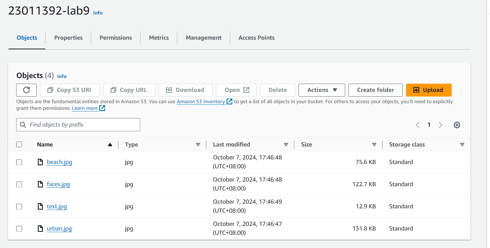

After uploading the images are inside my S3 bucket.


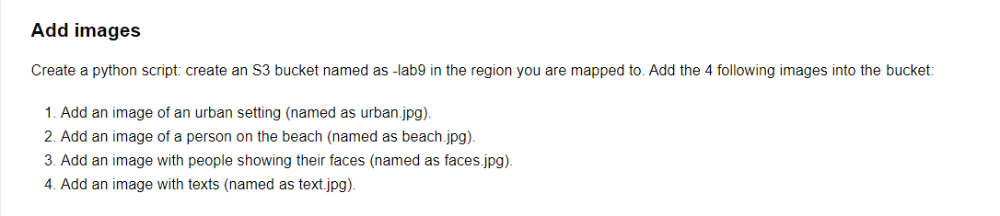


## Test AWS rekognition

```python
import boto3

# Create AWS Rekognition client
rekognition = boto3.client('rekognition', region_name='ap-northeast-1')


def detect_labels(bucket_name, image_name):
    """
    Detect labels in an image stored in an S3 bucket.
    """
    response = rekognition.detect_labels(Image={'S3Object': {'Bucket': bucket_name, 'Name': image_name}}, MaxLabels=10)
    print(f"Detected labels in {image_name}:")
    for label in response['Labels']:
        print(f"Label: {label['Name']}, Confidence: {label['Confidence']:.2f}%")
    print()


def moderate_image(bucket_name, image_name):
    """
    Detect if an image contains inappropriate content using AWS Rekognition.
    """
    response = rekognition.detect_moderation_labels(Image={'S3Object': {'Bucket': bucket_name, 'Name': image_name}})
    print(f"Moderation labels for {image_name}:")
    if response['ModerationLabels']:
        for label in response['ModerationLabels']:
            print(f"Label: {label['Name']}, Confidence: {label['Confidence']:.2f}%")
    else:
        print(f"No inappropriate content found in {image_name}.")
    print()


def detect_faces(bucket_name, image_name):
    """
    Detect faces and facial attributes in an image using AWS Rekognition.
    """
    response = rekognition.detect_faces(Image={'S3Object': {'Bucket': bucket_name, 'Name': image_name}},
                                        Attributes=['ALL'])
    print(f"Detected faces in {image_name}:")
    for face_detail in response['FaceDetails']:
        print(f"Confidence: {face_detail['Confidence']:.2f}%")
        print(f"Age range: {face_detail['AgeRange']['Low']} - {face_detail['AgeRange']['High']}")
        print(f"Gender: {face_detail['Gender']['Value']} (Confidence: {face_detail['Gender']['Confidence']:.2f}%)")
        print(f"Emotions: {[emotion['Type'] for emotion in face_detail['Emotions'] if emotion['Confidence'] > 50]}")
        print()
    if not response['FaceDetails']:
        print(f"No faces detected in {image_name}.")
    print()


def detect_text(bucket_name, image_name):
    """
    Detect and extract text from an image using AWS Rekognition.
    """
    response = rekognition.detect_text(Image={'S3Object': {'Bucket': bucket_name, 'Name': image_name}})
    print(f"Detected text in {image_name}:")
    if response['TextDetections']:
        for text in response['TextDetections']:
            print(f"Detected: {text['DetectedText']}, Confidence: {text['Confidence']:.2f}%")
    else:
        print(f"No text found in {image_name}.")
    print()


if __name__ == '__main__':
    student_id = '23011392'
    bucket_name = f'{student_id}-lab9'

    # List of images to test
    images = ['urban.jpg', 'beach.jpg', 'faces.jpg', 'text.jpg']

    # Test each image using AWS Rekognition
    for image in images:
        print(f"--- Processing {image} ---")

        # Detect labels in the image
        detect_labels(bucket_name, image)

        # Moderate image for inappropriate content
        moderate_image(bucket_name, image)

        # Detect faces (only applicable for 'faces.jpg')
        if image == 'faces.jpg':
            detect_faces(bucket_name, image)

        # Detect text (only applicable for 'text.jpg')
        if image == 'text.jpg':
            detect_text(bucket_name, image)

```

### Label Recognition 

I used `detect_labels()` from AWS Rekognition to identify objects, concepts, and scenes inside an image. The function analyzes
the image and returns a list of detected labels along with confidence score. Here is the output for Label for each image.

```bash
/home/streamc/.virtualenvs/CITS5503_Sem2/bin/python /home/streamc/Desktop/Labs/src/lab9.py 
--- Processing urban.jpg ---
Detected labels in urban.jpg:
Label: City, Confidence: 100.00%
Label: Landscape, Confidence: 100.00%
Label: Outdoors, Confidence: 100.00%
Label: Urban, Confidence: 100.00%
Label: Scenery, Confidence: 100.00%
Label: Cityscape, Confidence: 100.00%
Label: Metropolis, Confidence: 99.98%
Label: Panoramic, Confidence: 99.84%
Label: High Rise, Confidence: 99.82%
Label: Downtown, Confidence: 98.66%

--- Processing beach.jpg ---
Detected labels in beach.jpg:
Label: Person, Confidence: 99.96%
Label: Walking, Confidence: 99.96%
Label: Shorts, Confidence: 99.72%
Label: Beach, Confidence: 98.64%
Label: Outdoors, Confidence: 98.64%
Label: Sea, Confidence: 98.64%
Label: Standing, Confidence: 98.39%
Label: Adult, Confidence: 98.23%
Label: Male, Confidence: 98.23%
Label: Man, Confidence: 98.23%

--- Processing faces.jpg ---
Detected labels in faces.jpg:
Label: Face, Confidence: 100.00%
Label: Head, Confidence: 100.00%
Label: Person, Confidence: 100.00%
Label: Happy, Confidence: 100.00%
Label: Laughing, Confidence: 100.00%
Label: Adult, Confidence: 83.07%
Label: Female, Confidence: 83.07%
Label: Woman, Confidence: 83.07%
Label: Smile, Confidence: 80.38%
Label: Selfie, Confidence: 80.35%

--- Processing text.jpg ---
Detected labels in text.jpg:
Label: Page, Confidence: 99.99%
Label: Text, Confidence: 99.99%
Label: Chart, Confidence: 72.58%
Label: Plot, Confidence: 72.58%
Label: Letter, Confidence: 56.42%
Label: Number, Confidence: 56.39%
Label: Symbol, Confidence: 56.39%
Label: Computer Hardware, Confidence: 56.22%
Label: Electronics, Confidence: 56.22%
Label: Hardware, Confidence: 56.22%


Process finished with exit code 0

```

From the result of label detection, I can see that the detection of labels for each image is basically correct.

### Image Moderation

I use the `moderate_image()` function in AWS Rekognition to detect potentially inappropriate content within images, such 
as nudity, explicit material, or violence.

```bash
/home/streamc/.virtualenvs/CITS5503_Sem2/bin/python /home/streamc/Desktop/Labs/src/lab9.py 
--- Processing urban.jpg ---
Moderation labels for urban.jpg:
No inappropriate content found in urban.jpg.

--- Processing beach.jpg ---
Moderation labels for beach.jpg:
No inappropriate content found in beach.jpg.

--- Processing faces.jpg ---
Moderation labels for faces.jpg:
No inappropriate content found in faces.jpg.

--- Processing text.jpg ---
Moderation labels for text.jpg:
No inappropriate content found in text.jpg.
```
Based on my script and the output, there are no such scene in my images.

### Facial Analysis

I am using the `detect_faces()` function in AWS Rekognition to analyze faces in an image. 
It identifies faces and extracts attributes like gender, age range, emotions, and facial landmarks.

```bash
--- Processing faces.jpg ---
Detected faces in faces.jpg:
Confidence: 100.00%
Age range: 19 - 25
Gender: Female (Confidence: 99.98%)
Emotions: ['HAPPY']

Confidence: 99.61%
Age range: 23 - 29
Gender: Female (Confidence: 99.99%)
Emotions: ['HAPPY']

Confidence: 99.98%
Age range: 25 - 33
Gender: Male (Confidence: 99.98%)
Emotions: ['HAPPY']

Confidence: 99.94%
Age range: 25 - 33
Gender: Male (Confidence: 99.75%)
Emotions: ['HAPPY']

Confidence: 99.94%
Age range: 19 - 25
Gender: Female (Confidence: 99.04%)
Emotions: ['HAPPY']
```

There are 4 whole faces and 1 half face in the image I provided. Which are all successfully detected by the API with HAPPY emotions.

### Text Extraction From Images

I use the `detect_text()` function in AWS Rekognition to detect and extract any text present in the image. This function
is particularly useful for images containing written content such as signs, posters, or documents.

```bash
/home/streamc/.virtualenvs/CITS5503_Sem2/bin/python /home/streamc/Desktop/Labs/src/lab9.py 
Detected text in text.jpg:
Detected: Add images, Confidence: 100.00%
Detected: Create a python script: create an S3 bucket named as -lab9 in the region you are mapped to. Add the 4 following images into the bucket, Confidence: 96.70%
Detected: 1. Add an image of an urban setting (named as urban.jpg)., Confidence: 99.38%
Detected: 2. Add an image of a person on the beach (named as beach.jpg)., Confidence: 99.35%
Detected: 3. Add an image with people showing their faces (named as faces.jpg)., Confidence: 99.27%
Detected: 4. Add an image with texts (named as text.jpg)., Confidence: 99.15%
Detected: Add, Confidence: 100.00%
Detected: images, Confidence: 100.00%
Detected: Create, Confidence: 99.97%
Detected: a, Confidence: 98.72%
Detected: python, Confidence: 99.91%
Detected: script:, Confidence: 81.98%
Detected: create, Confidence: 100.00%
Detected: an, Confidence: 99.75%
Detected: S3, Confidence: 99.75%
Detected: bucket, Confidence: 99.77%
Detected: named, Confidence: 99.42%
Detected: as, Confidence: 99.63%
Detected: -lab9, Confidence: 100.00%
Detected: in, Confidence: 100.00%
Detected: the, Confidence: 100.00%
Detected: region, Confidence: 100.00%
Detected: you, Confidence: 100.00%
Detected: are, Confidence: 99.76%
Detected: mapped, Confidence: 100.00%
Detected: to., Confidence: 64.97%
Detected: Add, Confidence: 100.00%
Detected: the, Confidence: 99.64%
Detected: 4, Confidence: 99.05%
Detected: following, Confidence: 99.78%
Detected: images, Confidence: 99.98%
Detected: into, Confidence: 99.88%
Detected: the, Confidence: 99.75%
Detected: bucket, Confidence: 72.61%
Detected: 1., Confidence: 98.44%
Detected: Add, Confidence: 99.86%
Detected: an, Confidence: 99.97%
Detected: image, Confidence: 99.86%
Detected: of, Confidence: 99.97%
Detected: an, Confidence: 99.82%
Detected: urban, Confidence: 100.00%
Detected: setting, Confidence: 100.00%
Detected: (named, Confidence: 100.00%
Detected: as, Confidence: 100.00%
Detected: urban.jpg)., Confidence: 95.30%
Detected: 2., Confidence: 95.82%
Detected: Add, Confidence: 100.00%
Detected: an, Confidence: 99.92%
Detected: image, Confidence: 100.00%
Detected: of, Confidence: 100.00%
Detected: a, Confidence: 99.12%
Detected: person, Confidence: 100.00%
Detected: on, Confidence: 99.73%
Detected: the, Confidence: 99.79%
Detected: beach, Confidence: 100.00%
Detected: (named, Confidence: 100.00%
Detected: as, Confidence: 99.84%
Detected: beach.jpg)., Confidence: 97.28%
Detected: 3., Confidence: 95.63%
Detected: Add, Confidence: 100.00%
Detected: an, Confidence: 99.74%
Detected: image, Confidence: 100.00%
Detected: with, Confidence: 99.92%
Detected: people, Confidence: 99.92%
Detected: showing, Confidence: 100.00%
Detected: their, Confidence: 99.72%
Detected: faces, Confidence: 100.00%
Detected: (named, Confidence: 100.00%
Detected: as, Confidence: 99.60%
Detected: faces.jpg)., Confidence: 96.66%
Detected: 4., Confidence: 99.55%
Detected: Add, Confidence: 99.95%
Detected: an, Confidence: 99.35%
Detected: image, Confidence: 100.00%
Detected: with, Confidence: 99.78%
Detected: texts, Confidence: 99.83%
Detected: (named, Confidence: 100.00%
Detected: as, Confidence: 99.29%
Detected: text.jpg)., Confidence: 94.59%


Process finished with exit code 0

```

The text within the image have been successfully extracted.